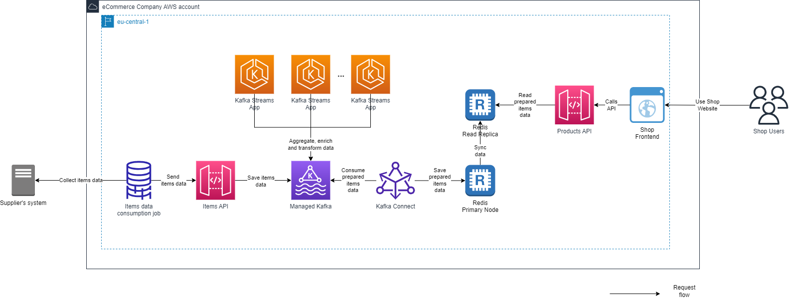
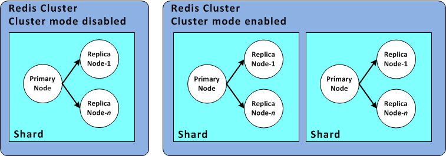

<!-- TOC -->
* [How to Deal with Memory Pressure in Redis](#how-to-deal-with-memory-pressure-in-redis)
    * [Redis Overview and Benefits](#redis-overview-and-benefits)
    * [Redis Hosting and Configuration Options](#redis-hosting-and-configuration-options)
        * [On Premises](#on-premises)
        * [Managed Service in the AWS Cloud](#managed-service-in-the-aws-cloud)
    * [Memory Considerations](#memory-considerations)
        * [Limited Storage Capacity](#limited-storage-capacity)
        * [Non-Durability](#non-durability)
    * [Real World Case Study](#real-world-case-study)
        * [Project Setup](#project-setup)
        * [Events Which Occurred](#events-which-occurred)
        * [Addressing the Issue](#addressing-the-issue)
            * [Monitoring and Alerting](#monitoring-and-alerting)
            * [Optimising Data Structures and Writing Logic](#optimising-data-structures-and-writing-logic)
            * [Vertical Upscaling](#vertical-scaling)
            * [Backups](#backups)
            * [Data Partitioning and Horizontal Scaling](#data-partitioning-and-horizontal-scaling)
            * [Availability](#availability)
            * [Appropriate Technology Usage According to Your Requirements](#appropriate-technology-usage-according-to-your-requirements)
    * [Lessons Learned](#lessons-learned)
<!-- TOC -->

# How to Deal with Memory Pressure in Redis

Redis has emerged as a popular and powerful open-source in-memory data structure store.
With its fast and efficient performance, Redis is widely adopted for various use cases, ranging from caching to real-time analytics and pub/sub messaging.
As Redis handles large volumes of data in memory, it becomes crucial for system administrators and developers to proactively address memory issues to ensure smooth operations and optimal performance.

In this article, we will explore what Redis is, delve into its suitability for different applications, and focus on the steps necessary to effectively deal with memory overload issues.
Drawing inspiration from a real production scenario, we will highlight practical strategies to optimize memory utilization and mitigate the impact of memory pressure on Redis instances, primarily focusing on managing the Redis cluster provided as a managed service in AWS - because of configuration options and simple instruments the cloud provides.

## Redis Overview and Benefits

Redis, an acronym for Remote Dictionary Server, is an open-source, in-memory data structure store that offers remarkable performance and versatility. 
It serves as a valuable tool in modern application development, enabling developers to address various data storage and retrieval requirements efficiently.

At its core, Redis is designed to deliver blazing-fast operations by keeping all data in memory. 
Unlike traditional disk-based databases, Redis's reliance on memory allows it to achieve sub-millisecond response times, making it ideal for latency-sensitive applications that demand real-time data access.

Redis supports a rich set of data structures, including strings, lists, sets, sorted sets, hashes, and more. 
These data structures are more than just containers; they come with powerful and specialized operations that enable developers to perform complex computations and data manipulations directly within Redis. 
For instance, Redis allows set intersections, union operations, and rank-based sorting, making it well-suited for a wide range of use cases.

One of the key benefits of Redis is its simplicity. 
The Redis API is straightforward and intuitive, enabling developers to quickly grasp its concepts and leverage its capabilities. 
Redis can be easily integrated into existing applications, acting as a caching layer to improve performance or as a primary data store for specific use cases.

Redis's versatility extends beyond its in-memory nature and data structures. 
It also provides built-in features like replication, persistence, and pub/sub messaging, making it a comprehensive solution for various application requirements. 
Redis replication enables high availability and fault tolerance by allowing the creation of replicas that can take over if the master node fails. 
Persistence options, such as snapshotting and append-only file (AOF) mode, provide durability to the data stored in Redis, ensuring data persistence across restarts or failures.

Additionally, Redis excels at pub/sub messaging, allowing for real-time communication between different components of a distributed system. 
Its publish/subscribe mechanism enables message broadcasting and real-time event processing, making it a powerful tool for building scalable and responsive applications.

Overall, Redis offers a combination of speed, simplicity, and versatility that makes it a compelling choice for a wide range of use cases. 
By leveraging its in-memory nature, diverse data structures, and built-in features, developers can harness the full potential of Redis to enhance application performance, scalability, and responsiveness.

## Redis Hosting and Configuration Options

Before jumping into memory usage specifics, let's get some context on the options where could we potentially host our Redis storage.
We will review two primary concepts: on premises hosting and using a managed service in the cloud.

### On Premises

On-premises Redis hosting involves setting up and managing Redis instances within your own infrastructure. 
This option offers complete control over the Redis environment but requires significant upfront investment in hardware, networking, and ongoing maintenance. 
Some key considerations for on-premises Redis hosting include:

a. Hardware and Networking: You have the flexibility to choose hardware specifications tailored to your specific requirements, including CPU, RAM, and storage. Network configuration can be optimized for low latency and high throughput, ensuring optimal Redis performance.

b. Security and Compliance: With on-premises hosting, you have direct control over security measures and can enforce compliance standards specific to your organization's needs. This includes implementing firewalls, encryption, access controls, and auditing mechanisms.

c. Scalability and Flexibility: Scaling Redis in an on-premises environment requires careful planning and provisioning of additional hardware resources. Upgrades and capacity adjustments may involve additional costs and effort, making it less flexible compared to cloud-based options.

d. Operational Overhead: On-premises hosting places the responsibility of infrastructure setup, maintenance, backups, and monitoring on your organization's IT team. This requires expertise and resources for ongoing management and support.

### Managed Service in the AWS Cloud

The most straightforward and simple way to have a Redis storage in AWS cloud is using AWS ElastiCache service. It is a managed Redis service provided by Amazon Web Services (AWS).
It offers a hassle-free way to deploy and operate Redis clusters in the cloud. 
Key advantages of AWS ElastiCache include:

a. Managed Service: ElastiCache handles infrastructure provisioning, configuration, scaling, and maintenance tasks, allowing you to focus on application development instead of operational aspects. AWS takes care of patching, backups, and software updates, ensuring a reliable and secure Redis environment.

b. Scalability and Elasticity: ElastiCache makes it easy to scale Redis clusters vertically (by adding more memory to individual nodes) or horizontally (by adding or removing nodes) based on changing workload demands. This enables seamless scalability and accommodates fluctuating traffic patterns.

c. High Availability and Fault Tolerance: ElastiCache provides automatic failover and replication capabilities, ensuring high availability of Redis clusters. It employs features like Multi-AZ replication, which synchronously replicates data across availability zones to withstand failures.

d. Integration with AWS Ecosystem: ElastiCache seamlessly integrates with other AWS services, enabling you to leverage additional capabilities. For example, you can integrate ElastiCache with AWS Identity and Access Management (IAM) for fine-grained access control, or use AWS CloudWatch for monitoring and performance analysis.

e. Cost-Effectiveness: AWS ElastiCache follows a pay-as-you-go pricing model, where you pay for the resources consumed. This eliminates the need for upfront infrastructure investment and allows you to optimize costs based on actual usage.

It's important to note that while AWS ElastiCache offers convenience and scalability, it also introduces dependencies on the AWS platform and incurs ongoing operational costs. 
Organizations must evaluate their specific requirements, cost considerations, and expertise before choosing between on-premises hosting or a managed service like AWS ElastiCache for Redis.

## Memory Considerations

When utilizing Redis, it is crucial to take into account few memory considerations which can impact your application's data management strategy.

### Limited Storage Capacity

Redis stores data primarily in memory, which provides unparalleled speed and performance. 
However, this also means that the amount of data you can store is constrained by the available memory on the hosting machine. 
Unlike disk-based databases that can scale storage capacity easily, Redis's memory capacity is directly tied to the physical or virtual machine it runs on. 
It is essential to carefully estimate your data requirements and provision sufficient memory to accommodate your dataset.

To optimize memory usage in Redis, consider employing strategies such as data compression, data partitioning, or using Redis modules like Redis Streams or RedisGears to process data on the fly. 
These techniques can help reduce the memory footprint and allow you to store more data within the available memory.

### Non-Durability

Redis, by default, prioritizes speed and performance over durability. 
This means that Redis does not guarantee persistent storage of data on disk like traditional databases. 
While Redis offers persistence options like snapshotting and append-only file (AOF) mode, they introduce additional disk I/O overhead and can impact performance. 
Moreover, AOF can't protect against all failure scenarios. For example, in AWS, if a node fails due to a hardware fault in an underlying physical server, ElastiCache provisions a new node on a different server. 
In this case, the AOF file is no longer available and can't be used to recover the data. Thus, Redis restarts with a cold cache.
It's often recommended to have one or more read replicas in multiple availability zones in the cloud for Redis to be on a safer side.

In the event of a Redis restart or failure, data stored solely in memory may be lost. 
Therefore, it is crucial to have proper backup and recovery mechanisms in place to protect against data loss. 
This can include regular snapshots, using Redis AOF persistence mode, or implementing replication and high-availability configurations to ensure data redundancy across multiple Redis instances.

To address the durability concern, some organizations choose to combine Redis with other databases for a hybrid approach. 
For example, critical data can be stored both in Redis for fast access and in a durable database for long-term persistence.

## Real World Case Study

### Project Setup

Now that we have a basic understanding of Redis and its memory considerations, let's delve into a real-life scenario where memory pressure had a significant impact on the operational excellence of a business. 
We will analyze the initial design mistakes and the steps taken to mitigate the issues.

To provide some context, let's consider a large eCommerce company that operates an online shopping system. 
They offer a variety of consumer goods such as shoes, home decor, and more. 
In our analysis, we will focus on the product management aspect of the business. 
This involves a software system responsible for retrieving information about items, including prices, available configurations (such as sizes), from supplier systems. 
The software applies necessary data enriching, aggregation, and transformation business logic to provide updated data via an API. 
This API allows the shopping frontend to display the items to end-users.

Technologically, this part of the system utilizes an event-driven solution that consists of the following components:

- Apache Kafka: Acts as an intermediate data store, capturing all the state updates of the items including intermediate changes made by the system.
- Kafka Streams: Provides functionality for data aggregation, processing, and transformation.
- Kafka Connect: Facilitates the transfer of data from Kafka topics to a storage system.
- AWS ElastiCache Redis: Serves as the storage for prepared item data.
- Java Spring Boot application: Acts as an API, enabling the shopping frontend to access item data.

The diagram below illustrates the conceptual view of the system:



By examining this scenario, we can identify the challenges faced and explore the subsequent actions taken to address memory pressure issues.

We can already see that in the business product's context Redis is expected to act as a durable storage which Shopping Frontend relies upon, while it's not guaranteed for any Redis instance due to its memory management specifics.
And we also have to consider that Redis here exists as a non-cluster instance with a read replica in a separate availability zone. That means that the only way to scale the storage up is to do the vertical scaling of the nodes, adding more memory capacity.

It's also worth mentioning for that specific context that data retention period in Kafka was set to 1 month, which was a fairly large period which allows to replay the data to the storage if anything happens.

### Events Which Occurred

The initial setback occurred during the peak season, coinciding with Easter. 
Unfortunately, all the items in the shop went offline, leading to a significant impact on the business. 
Upon investigating the issue, the tech department discovered that the Redis storage was completely empty, causing the API to implement a fallback strategy where unavailable items were marked as not available.

Further investigation revealed that the memory usage had spiked from 62% to 100% within a few hours, resulting in Redis no longer accepting write commands. 
To compound the problem, the primary node responsible for accepting writes had restarted during a service disruption, leading to the complete loss of data.

Having a read replica in another availability zone did not alleviate the situation. 
When the primary node became unresponsive and triggered a restart, the replica took over as the new primary node. 
However, due to continuous data synchronization, the replica's memory capacity was fully occupied, rendering it unavailable as well. 
Consequently, the replica was also restarted and replaced with a newly cleaned-up node. 
Eventually, both nodes came back online, but they were completely empty, resulting in a disruption to the normal functioning of the shop.

It is important to note that AWS does not guarantee that ElastiCache nodes will always restart once the memory usage capacity is reached. 
While these events are often correlated, they do not necessarily occur simultaneously. 
Normally, when the memory capacity is reached, Redis would simply stop accepting additional writes to prevent further memory usage. 
However, in this unfortunate case, both nodes experienced restarts, and the exact reason for this was not provided by AWS Support, as they are not obligated to disclose such information.

Regardless, the outcome was that the storage became entirely empty, causing significant disruption to the shop's operations.

To fix the issue, the tech department had to replay all the items data from Kafka topics to Redis, and that included:
- Stopping Kafka Connectors
- Deleting Kafka Connectors
- Resetting the offsets of corresponding Consumer Groups by executing the command:
```
./bin/kafka-consumer-groups.sh --bootstrap-server :9092 --group connectorName --reset-offsets --to-earliest --execute --topic topicName
```
- Adding the connectors and their configuration back
- Starting the connectors again

This whole process resulted in few hours of downtime, which obviously had a major business impact, and after returning the system to the business-as-usual state, the team had to make sure that thing won't happen again.

### Addressing the Issue

#### Monitoring and Alerting

First of all, the team had to improve their observability of the system they are working with - to become more proactive, to foresee the issues before they are occurring or starting impacting the business.
Having Redis as a managed service in AWS, it is a relatively simple task to achieve, as there is a metric for ElastiCache called "DatabaseMemoryUsagePercentage" - indicating how much memory is used by the storage.
The only remaining thing is to make sure that monitoring of that metric is automated and if it exceeds the approved threshold, the team would be notified:

1. Create an Amazon CloudWatch Alarm: CloudWatch is a monitoring service in AWS that can collect and track metrics. You'll start by creating an alarm that will trigger when the DatabaseMemoryUsagePercentage metric exceeds a specified threshold. This can be done in the Alarms screen of CloudWatch service. There you'd be able to select the desired metric, the threshold indicating the percentage of memory used when you want to be notified, and the action to be taken (for example, an email to the team or a Lambda function trigger which would send an alert to the corporate messenger).
2. Enable "Enhanced Monitoring" for your ElastiCache cluster, via the Modify options of the cluster - to make sure that DatabaseMemoryUsagePercentage metric is available to you and to CloudWatch.
3. Configure additional actions on alarm if needed.

Additionally, you may want to be notified about major events happening to your Redis storage, like failover, node restart, backup events, node replacements and others.
To achieve that, you can:

1. Set up an SNS topic where these events will be sinked by ElastiCache service
2. Enable the SNS notifications in ElastiCache service
3. Specify your new topic as the destination
4. Configure the actions to be taken once an event lands to the topic - similarly to CloudWatch alarms (email, Lambda trigger etc.)

You can read more about the concept of SNS notifications on important ElastiCache events [here](https://docs.aws.amazon.com/AmazonElastiCache/latest/red-ug/ECEvents.SNS.html).

If you have your Redis storage on premises, you may want to leverage some software like Datadog to configure the monitoring for your internal resources in a similar way like it's done for AWS.

#### Optimising Data Structures and Writing Logic

If you are responsible for maintaining the operational excellence of your Redis cluster, it is essential to have a deep understanding of how your system works and the various processes and integrations it utilizes with regard to your target datastore. 
Ideally, you should have conceptual views of your system in the form of diagrams or a comprehensive list that outlines which applications read from and write to your datastore. 
In the case of a key-value storage system, it is also valuable to know the key formats used by different systems for reading and writing.

By gaining insights into the integrated applications and the key patterns they utilize, you can effectively analyze your Redis cluster. 
Running scan queries to count records based on key patterns, the team was able to identify an outdated Kafka Streams application that was solely intended for data analytics. 
This application was no longer relevant to our business and was unnecessarily generating massive amounts of data. 
Once identified, the team promptly removed this application and cleaned up the Redis store, eliminating the burden of unused records.

In addition to reviewing your system's integrations and identifying obsolete applications, optimizing your data structures can significantly enhance memory usage efficiency. 
For instance, consider utilizing Redis Hashes instead of individual keys for storing object fields, as they are more memory-efficient. 
Moreover, taking advantage of Redis' data compression capabilities, such as Redis Modules like RedisGears, enables you to compress data before storing it in Redis. 
This helps to reduce the overall memory footprint of your cluster.

Furthermore, leveraging the TTL (Time to Live) attribute for your records can be beneficial if you don't require data to be stored indefinitely in your Redis cluster. 
By scheduling the automatic removal of records after a certain period, you can effectively manage memory consumption and keep your cluster lean and optimized.

In conclusion, ensuring the operational excellence of your Redis cluster requires a comprehensive understanding of its inner workings, including the processes, integrations, and key patterns involved. 
By conducting thorough analyses, such as identifying unused applications and optimizing data structures, you can improve memory usage efficiency and maintain a streamlined Redis cluster. 
Implementing strategies like data compression and utilizing TTL attributes further contribute to optimizing memory usage and overall performance.

#### Vertical Scaling

When your business experiences growth and your data storage requirements increase, it becomes necessary to consider scaling up the memory capacity of your Redis cluster. 
One option is to leverage ElastiCache's vertical scaling capabilities, which involve modifying the instance type in your AWS environment. 
Another possibility is to provide a machine with a larger memory capacity and perform the migration if your Redis is hosted on premises.

By scaling up the memory capacity, you enable your Redis deployment to handle larger volumes of data and alleviate memory pressure. 
This is especially crucial in situations where the amount of data stored and the demands on your Redis cluster are rapidly expanding. 
Scaling vertically allows you to meet these growing needs effectively.

However, it is important to keep in mind that vertical scaling does require time and planning. 
If your Redis cluster experiences a sudden peak in memory pressure, the process of scaling up may not be able to provide immediate relief. 
It's crucial to anticipate and prepare for such scenarios by monitoring the memory usage closely and considering alternative strategies, such as horizontal scaling or implementing caching mechanisms, to ensure smooth operation even during peak periods.

In conclusion, the decision to scale up the memory capacity of your Redis cluster is a significant step in accommodating the growing demands of your business. 
By utilizing ElastiCache's vertical scaling capabilities or adopting a larger capacity machine, you can enhance your Redis deployment's ability to handle expanding data volumes. 
However, it's essential to plan ahead, monitor memory usage, and be prepared for sudden spikes in memory pressure to maintain optimal performance.

#### Backups

When it comes to ElastiCache, Redis backups are performed as snapshots and stored in AWS S3. 
However, it's important to note that these backups typically do not serve as a direct solution for alleviating memory pressure in an active storage environment. 
Instead, they primarily act as a safety measure, providing a recovery point that you can roll back to in situations where major business impacts are acceptable and memory pressure is not a concern.

It's crucial to keep in mind that if you need to restore your Redis cluster from a backup, AWS will create a new cluster using the data from the backup. 
It is not capable of directly seeding the backup data into your existing cluster. 
This can result in additional configuration changes for your system, as the restored cluster may require adjustments to ensure compatibility and consistency with your application.

While backups are a valuable component of your overall Redis storage strategy, they should not be solely relied upon for addressing memory pressure issues. 
Instead, it is advisable to explore other approaches, such as vertical or horizontal scaling, to effectively handle increased data volumes and mitigate memory constraints in real-time.

In summary, while ElastiCache's Redis backups stored in AWS S3 provide a recovery mechanism and safety net, they are not specifically designed to resolve memory pressure concerns in an active storage environment. 
It's important to understand their limitations and consider alternative strategies for addressing memory pressure, such as scaling options, to ensure optimal performance and reliability of your Redis cluster.

#### Data Partitioning and Horizontal Scaling

If your workload exhibits a skewed data distribution pattern, you can implement data partitioning to evenly distribute the data across multiple Redis shards. 
By partitioning your data, you can distribute the memory load and prevent excessive memory usage on specific shards.
In AWS, you can do so by creating a Redis storage with Cluster Mode Enabled, or by migrating your existing storage from Cluster Mode Disabled to Cluster Mode Enabled, including making all the integration preparations like changing the SDK.
The following [article](https://docs.aws.amazon.com/AmazonElastiCache/latest/red-ug/modify-cluster-mode.html) has more information on the migration process.

AWS also provides an illustration showing the visual differences between clustered and non-clustered mode, which is shown below:



However, keep in mind the considerations and complexities involved in managing partitioned data. 
For example, in AWS, you have to manage your key slots partitions, i.e. configure which shards would host which range of keys - either in even or in custom distribution.
In addition, you need to make sure that your integrated applications support the cluster protocol for Redis.

Having your data partitioned across shards, you can then consider horizontal scaling by adding more shards to your Redis cluster. 
Horizontal scaling allows you to distribute data across multiple nodes, thereby increasing the overall memory capacity and performance of your Redis deployment. 
ElastiCache makes it seamless to add or remove shards without disrupting your application.
Horizontal scaling is a simpler and quicker process than vertical scaling in most of the cases, and it can happen automatically without service disruptions. 
However, you have to know that the process could bring some performance degradation during scaling.

#### Availability

While the issue of availability is not directly related to memory pressure, ensuring the availability of your Redis cluster is still a crucial concern, particularly when dealing with mission-critical storage systems. 
There are several strategies you can employ to enhance the availability of your Redis cluster.

First and foremost, in an AWS environment, it is advisable to consider implementing Read Replicas for your Redis cluster. 
By distributing the overall load across multiple nodes, including the primary node that accepts write commands and multiple Read Replicas that handle read load, you can effectively balance the workload. 
Additionally, enabling data partitioning allows for write load to be distributed across multiple nodes or shards, removing potential bottlenecks within the system. 
This approach not only improves performance but also increases the fault tolerance of your Redis cluster.

Furthermore, to enhance resiliency, it is recommended to expand your Redis cluster across multiple Availability Zones (AZs) within the same AWS region. 
ElastiCache's Multi-AZ deployments offer the ability to automatically replicate data synchronously to standby replicas in different AZs. 
This replication process increases the availability and durability of your data. By distributing the memory load across multiple AZs, the pressure on individual nodes is reduced, leading to improved performance and reliability.

It's important to note that implementing these availability-enhancing measures also prepares you for failover scenarios. 
In the event of an issue with the primary node, one of the Read Replicas can seamlessly replace it with minimal downtime. 
AWS handles the provisioning of another Read Replica to compensate for the replacement, ensuring continuous operations and mitigating the impact on your Redis cluster's availability.

#### Appropriate Technology Usage According to Your Requirements

In addition to the points discussed earlier, it is crucial to thoroughly understand your business processes and requirements in order to assess your system effectively. 
By mapping your solution to the specific requirements and examining their compatibility, you can ensure a proper fit between your storage solution and the needs of your business.

For instance, in the case of the eCommerce scenario, the primary requirements for the storage solution included data durability and read performance. 
While Redis is renowned for its high-performance capabilities, concerns arise regarding the data durability and resilience of such a technology.

Redis nodes, even in a cloud environment, can still fail, potentially leading to the loss of data stored in the Append-Only File. 
Although data partitioning and Multi-AZ deployments can mitigate this risk to some extent, there is still the possibility of business impact due to service disruptions during failover or the loss of certain data segments.

In situations where data durability and resilience are critical, it is worth revisiting alternative solutions that offer both performance and confirmed data durability. 
AWS DynamoDB or MongoDB appliance are examples of key-value-based data storage solutions that prioritize data durability and resilience, providing more reliable options for business-critical applications.

By reevaluating your requirements and considering alternative storage solutions, you can ensure a better match between your business needs and the capabilities of the chosen technology. 
This assessment helps to mitigate the risk of data loss or service disruption and ultimately supports the long-term success and reliability of your storage infrastructure.

## Lessons Learned

Summarizing the knowledge we have gathered, the following points can be highlighted as general recommendations for effectively managing memory pressure in your Redis cluster:

1. Ensure comprehensive observability for your system, whether it is deployed on premises or in the cloud. This includes monitoring, access to metrics, and alerting mechanisms. These tools will provide timely insights and allow you to take proactive measures before the issue escalates.
2. Familiarize yourself with the business processes your system supports, understand the system context, and be aware of the integrations with your storage solution. This knowledge enables you to review and identify any anomalies in behavior that may contribute to memory pressure.
3. Make informed decisions when selecting technologies based on the specific requirements of your business. If risks are identified and resources are available, consider migrating to alternative solutions that better align with your needs.
4. Explore cloud-based storage solutions if it aligns with your business and policies. Leveraging cloud services shares the responsibility of storage management and provides automated instruments that can reduce overhead. This approach often leads to cost savings as well.
5. Utilize Read Replicas to distribute both write and read loads across nodes. Additionally, establish a failover scenario to ensure continuity in the event of a primary node failure.
6. Optimize data structures by employing techniques such as data compression and selecting appropriate record types. Additionally, consider utilizing the TTL attribute to manage record expiration when long-term storage is not necessary.
7. Evaluate data partitioning and automatic horizontal scaling options to remove bottlenecks, facilitate seamless scaling, and distribute the workload. Keep in mind that implementing these approaches may require adjustments to your integrations and configurations related to sharding.
8. Consider vertical scaling if deemed necessary, but be aware that this process takes time and may not provide immediate relief in cases of sudden memory pressure spikes.
9. Implement Multi-AZ deployments to enhance the resiliency of your Redis cluster. By spanning your deployment across multiple Availability Zones, you can mitigate the impact of zone failures and improve the overall reliability of your system.

By implementing these strategies and leveraging the capabilities offered by cloud platforms, you can effectively manage memory pressure in your Redis deployment. This approach ensures optimal performance and reliability for your applications while providing scalability and fault tolerance to accommodate growing demands.
